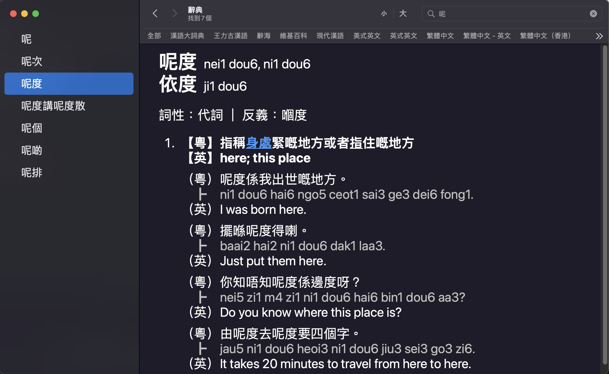

# wordshk-tools

A combination of tools for words.hk (粵典).

## Parser
```rust
/// Parse the whole words.hk CSV database into a [Dict]
pub fn parse_dict() -> Result<Dict, Box<dyn Error>>
```
Located at `/src/lib.rs`

Parses all entries marked with OK and store the results as a list of entries. This parser is the very core of this library because its output is used by other functions like `to_apple_dict`.
To boost efficiency, no regular expressions and backtracking are used. It is powered by a library called [lip](https://github.com/AlienKevin/lip) (written by myself) that provides
flexible parser combinators and supports friendly error messages.

## Export to Apple Dictionary



```rust
/// Convert a [Dict] to Apple Dictionary XML format
pub fn to_apple_dict(dict: Dict) -> String
```
Located at `/src/lib.rs`

Convert a `Dict` produced by `parse_dict()` to Apple Dictionary XML format. The main program at `/src/main.rs` combines these two steps to export an XML file, which you can run at the project root with:
```
cargo run -- < path/to/wordshk.csv > ./wordshk_apple/wordshk.xml
```

To build the dictionary and install it to Dictionary.app, you will need to install the **Dictionary Development Kit** [(reference)](https://apple.stackexchange.com/a/80110/398222):
1. Registering a free Apple developer account
2. Download the **Additional Tool for Xcode** package (look for the latest version) from developer.apple.com/downloads
3. Move the Dictionary Development Kit folder to `/Applications/Utilities/Dictionary Development Kit/`

Then, cd into the `/wordshk_apple` folder and run `make && make install`. If everything is successful, you should see a bunch of messages printed to the console and the last line should be "To test the new dictionary, try Dictionary.app." If you have already opened Dictionary.app, close it and reopen it. Under Dictionary->Preferences, you should see a dictionary called 粵典 words.hk, check the box to the left to enable words.hk. Now, you should be able to search all entries in words.hk like any other native Apple dictionaries.

## Doc
https://alienkevin.github.io/wordshk-tools/

### How to build & publish doc to GitHub Pages
* At the project root, run `cargo doc`.
* You should see a `/target/doc/wordshk_tools/` folder
* Copy all files in the above folder and all files under `/target/doc` (you don't need to copy any folder, they are docs for dependencies)
* Switch gh-pages branch by running `git checkout gh-pages`
* Paste all the files you copied in the above steps to the root
* Do a search and replace to remove all `../` in HTML files because we moved all of them to their parent folder
* Push the gh-pages branch to GitHub by running `git push`
* If you want to switch back to the main branch, run `git checkout main`

## Source

The full up-to-date CSV database of words.hk dictionary can be downloaded from this url: https://words.hk/static/all.csv.gz

## License
MIT
